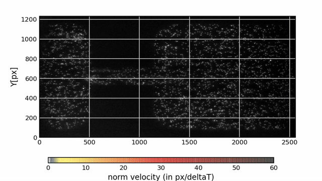


# About

OpyFlow : Python package for Optical Flow measurements

Opyflow is a basic image velocimetry tool to simplify your *video* or *frame sequences* processing.

It is based on `opencv` and `vtk` libraries to detect Good Features to Track (GFT), calculate their displacements by the Lukas Kanade method and interpolate them on a mesh. This method is sometimes called Feature Image Velocimetry or Feature Tracking. It is an alternative to the classical cross-correlation techniques employed in Particle Image Velocimetry (PIV). Compared to this technique, GFT+OpticalFlow may result in better performance when image qualities are poor for velocimetry, i.e. when velocity information on frames is non-uniform.

For flow calculations, the process is mainly inspired by the openCV python sample [lktrack.py](https://github.com/opencv/opencv/blob/master/samples/python/lk_track.py).

The package also contains some rendering tools built with matplotlib. Velocities can be exported (csv, tecplot, vtk, hdf5).

Author: Gauthier Rousseau

Corresponding e-mail : <gauthier.rousseau@gmail.com>

## Quick Start

To quickly get started with OpyFlow, follow these steps:

1. Ensure you have Python installed in your environment.
2. Open your terminal and run the following command to install OpyFlow and its main dependencies (matplotlib, vtk, and opencv):

   ```shell
   pip install opyf
   ```

   Alternatively, if you have the OpyFlow repository cloned locally, you can run:

   ```shell
   python3 -m pip install ./
   ```

3. This will automatically install the OpyFlow library and its dependencies.

To analyze a frame sequence (e.g., PNG, BMP, JPEG, TIFF), use the following code:

```python
import opyf
analyzer = opyf.frameSequenceAnalyzer("folder/toward/images")
```

For analyzing a video (e.g., MP4, AVI, MKV), use the following code:

```python
analyzer = opyf.videoAnalyzer("video/file/path")
```

To perform your first analysis, run the following code:

```python
analyzer.extractGoodFeaturesAndDisplacements()
```

OpyFlow package includes two frames and one video for testing and self-practice:

1. The two frames were extracted from the frame sequence of the Test case A of the *PIV Challenge 2014*:

   

   When applied to the entire dataset, OpyFlow can produce the above result (see [Test PIV Challenge 2014 - Case A](tests/Test_case_PIV_Challenge_2014/testPIVChallengeCaseA.md) for details on the procedure).

2. The video is a bird's eye view video of a stream river taken by a drone, from which surface velocities can be extracted (see this [tutorial](tests/Test_Navizence/opyf_Navizence_velocimetry_UAV.md) for different possible procedures or the following [python file](tests/Test_Navizence/test_opyf_Navizence.py)):

   

3. A guide is also provided to obtain the free surface velocity in a river from two amateur videos:  
   [Stabilization, orthorectification (bird's eye view transformation), and free surface velocity estimation on the Brague river with OpyFlow](tests/Test_Brague_flood/test_opyf_LSPIV_Brague.md)

   []()

## Contents

This repository is organized as follows:

The setup file:

- setup.py

The package Folder opyf:

- opyf
  - Analyzer.py
  - Track.py
  - Interpolate.py
  - Files.py
  - Filters.py
  - Render.py
  - Tools.py
  - custom_cmap.py (based on Chris Slocum file)

- test
  - Test_case_PIV_Challenge_2014
  - Test_land_slide_youtube_video
  - Test_Navizence
  - Test_Brague_flood

A test on synthetic images is still required.

## Installation with anaconda

The package requires python and basic python package: csv, numpy, matplotlib, tqdm, hdf5. Main dependencies are: OpenCV and VTK.

If the `pip install opyf` command above does not work for you, an alternative way to deal with dependencies is using miniconda or anaconda.

When miniconda/anaconda is installed you may create an environment (here called *opyfenv*). To create the environment type in the terminal:

```shell
conda create -n opyfenv python=3.11
```

This command line will install an environment with python 3.11 and the main dependencies.

You can access to your environment by typing:

```shell
conda activate opyfenv
```
### Installation using the standard python protocol to create a virtual environment

You can also use the standard python protocol (run the command where you want to put the environment):

```shell
python -m venv opyfenv
source opyfenv/bin/activate
```

From you environment, you should be able to install opyf with `pip install opyf`.

For development mode, you may also install the libraries individually with pip:

```shell
pip install ipython vtk opencv-python tqdm h5py matplotlib scipy ipykernel PyQt6
```

And set the opyf repository in your PATH or in the beginning of your python script using:

```python
import sys
sys.path.append("path/toward/opyf/src")
```

Tested on:
   - Python: 3.11
   - VTK: 9.2.6
   - OpenCV: 4.7
   - NumPy: 1.24
   - Matplotlib: 3.7.1

## Citation

This package has been developed in the course of my PhD at EPFL to study [Turbulent flows over rough permeable beds](https://infoscience.epfl.ch/record/264790/files/EPFL_TH9327.pdf). Outputs are visible in the manuscript as well as in this [Video](https://www.youtube.com/watch?v=JmwE-kL0kTk) where paraview animations have been rendered thanks to opyf outputs.

@PhdThesis{rousseau2019turbulent,
  title={Turbulent flows over rough permeable beds in mountain rivers: Experimental insights and modeling},
  author={Rousseau, Gauthier},
  year={2019},
  institution={EPFL}
}

An article published in *Experiments in Fluids* is available in Open Access : [Scanning PIV of turbulent flows over and through rough porous beds using refractive index matching](https://link.springer.com/article/10.1007/s00348-020-02990-y)

Follow this [link](https://link.springer.com/article/10.1007/s00348-020-02990-y#appendices) to directly access to the annex of the article presenting the opyf algorithms and tests.

@article{rousseau2020scanning,
  title={Scanning PIV of turbulent flows over and through rough porous beds using refractive index matching},
  author={Rousseau, Gauthier and Ancey, Christophe},
  journal={Experiments in Fluids},
  volume={61},
  number={8},
  pages={1--24},
  year={2020},
  publisher={Springer}
}

Contributors : Hugo Rousseau, Mohamed Nadeem, LHE team and others

Credits for UAV video : Bob de Graffenried

Credits for 2019 flood video on Brague River (Biot, French Riviera) : Pierre Brigode
