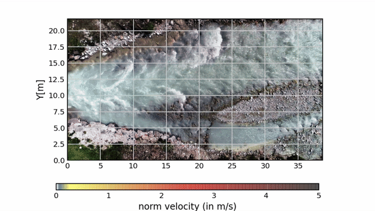


# About

OpyFlow : Python package for Optical Flow measurements

Opyflow is a basic image velocimetry tool to simplify your *video* or *frame sequences* processing.

It is based on `opencv` and `vtk` libraries to detect Good Features to Track (GFT), calculate their displacements by the Lukas Kanade method and interpolate them on a mesh. This method is sometimes called Feature Image Velocimetry. It is an alternative to the classical cross-correlation techniques employed in Particle Image Velocimetry (PIV). Compared to this technique, GFT+OpticalFlow may result in better performance when image qualities are poor for velocimetry, i.e. when velocity information is non-uniform on frames.

For flow calculations, the process is mainly inspired by the openCV python sample [lktrack.py](https://github.com/opencv/opencv/blob/master/samples/python/lk_track.py).

The package also contains some rendering tools built with matplotlib. Velocities can be exported (csv, tecplot, vtk, hdf5).

Author: Gauthier Rousseau

Corresponding e-mail : gauthier.rousseau@gmail.com

## Quick start

Assuming that you already have an environment with python installed (<=3.7), run the following command on your terminal:

```shell
pip install opyf
```

or from the *opyflow* repository

```shell
python setup.py install
```

This should install the opyf library and the main dependencies (vtk and opencv) automatically.

If you meet compatibility problems on your system, it is recommended creating an *environment* via *conda* installation (see bellow [installation with anaconda](#installation-with-anaconda)).

To analyze a frame sequence (*png*, *bmp*, *jpeg*, *tiff*) you may run the following script:

```python
import opyf
analyzer=opyf.frameSequenceAnalyzer("folder/toward/images")
```

For a video (*mp4*, *avi*, *mkv*, ... ):

```python
analyzer=opyf.videoAnalyzer("video/file/path")
```

To perform your first analyze run :

```python
analyzer.extractGoodFeaturesAndDisplacements()
```

opyf package contains two frames and one video for testing and practicing yourself:

- The two frames were extracted from the frame sequence of the Test case A of the *PIV Challenge 2014*


When applied to the entire dataset, It can produce the above result (see [Test PIV Challenge 2014 - Case A](test/Test_case_PIV_Challenge_2014/testPIVChallengeCaseA.md) for details on the procedure).

- The video is a bird eye view video of a stream river taken by a drone and from which surface velocities can be extracted ([see the following python file for the different possible procedures](test/Test_Navizence/test_opyf_Navizence.py) ).



## Contents

This archive is organized as follows:

The setup file:

- setup.py

The package Folder opyf:

- opyf

  - Track.py
  - Interpolate.py
  - Files.py
  - Filters.py
  - Render.py
  - custom_cmap.py (based on Chris Slocum file)

The test Folder:

- test

  - Test_case_PIV_Challenge_2014

    - CommandLines-Opyf-PIV-Challenge2014-Test.py

    - CommandLines-Opyf-PIV-Challenge2014-Test_Simple.py

    - mask.tiff

    - images (sample of 2 source images)

      - A_00001_a.tif
      - A_00001_b.tif
    - ReadMe_Download_Images.txt (instruction to download the entire image sequence of the test)
    - meanFlow.png (Results for the CommandLines)
    - rms.png
    - [testPIVChallengeCaseA.md](test/Test_case_PIV_Challenge_2014/testPIVChallengeCaseA.md)

  - Test_land_slide_youtube_video
    - OpyFlow_testcase_youtube_MA.py
    - OpyFlow_testcase_youtube_simple.py
    - mask.png
    - The video must be downloaded from youtube with the package pytube
    - ReadMe_download_a_youtube_video.txt (instruction to download the video)
  - Test_Navizence
    - [2018.07.04_Station_fixe_30m_sample.mp4](test/Test_Navizence/2018.07.04_Station_fixe_30m_sample.mp4)
    - [test_opyf_Navizence.py](test/Test_Navizence/test_opyf_Navizence.py)

One test file performed on the [PIV challenge 2014 caseA](http://www.pivchallenge.org/pivchallenge4.html#case_a):
The results are compared to the main findings of the challenge:
``-Kähler CJ, Astarita T, Vlachos PP, Sakakibara J, Hain R, Discetti S, Foy RL, Cierpka C, 2016, Main results of the 4th International PIV Challenge, Experiments in Fluids, 57: 97.''

A test on synthetic images is still required.

## Installation with anaconda

The package requires python and basic python package: csv, numpy, matplotlib, tqdm

The main dependencies are :

OpenCV
VTK

The code uses recent versions of VTK and openCV.

If the `pip install opyf` command above does not work for you, the simplest way to deal with incompatibilities is using miniconda or anaconda.

When miniconda/anaconda is installed you may create an environment (here called *opyfenv*). To create the environment type in the terminal:

```shell
conda create -n opyfenv python=3.6 vtk opencv matplotlib scipy tqdm (spyder)
```

```shell
source activate opyfenv
```

These command lines will install an environment with python 3.6

For python 3.7 you should use the *conda-forge* channel:

```shell
conda create -n opyfenv python=3.7 vtk opencv matplotlib scipy tqdm (spyder) --channel conda-forge
```

Tested on:
Python version: 3.6 and 3.7
VTK : 7.0.1 and +
opencv : 3.2 and +
numpy: 1.17
matplotlib : 2.0.0

## Citation

This package has been developed in the course of my PhD at EPFL to study [Turbulent flows over rough permeable beds](https://infoscience.epfl.ch/record/264790/files/EPFL_TH9327.pdf). Outputs are visible in the manuscript as well as in this [Video](https://www.youtube.com/watch?v=JmwE-kL0kTk) where paraview animations have been rendered thanks to opyf outputs.

@PhdThesis{rousseau2019turbulent,
  title={Turbulent flows over rough permeable beds in mountain rivers: Experimental insights and modeling},
  author={Rousseau, Gauthier},
  year={2019},
  institution={EPFL}
}

Contributors : Hugo Rousseau, Mohamed Nadeem, LHE team and others

Credits for UAV video : Bob de Graffenried
