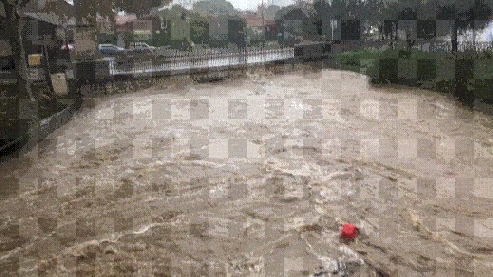
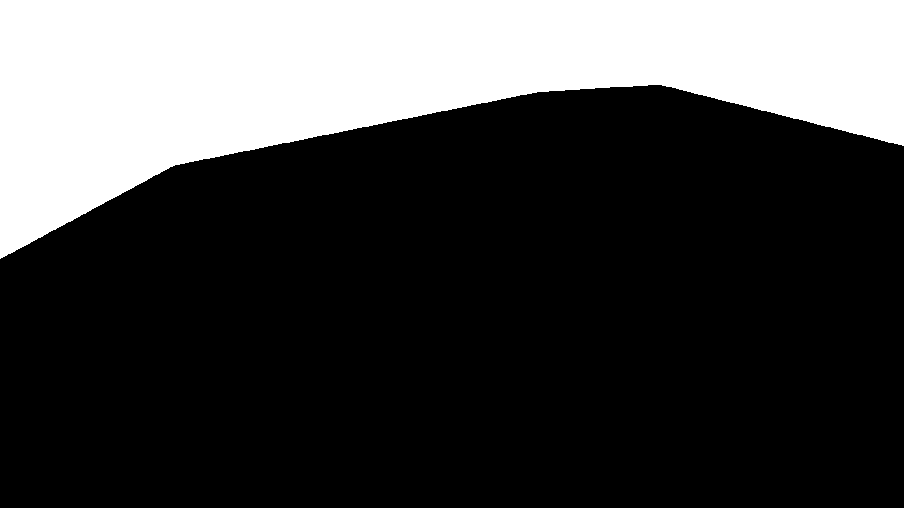
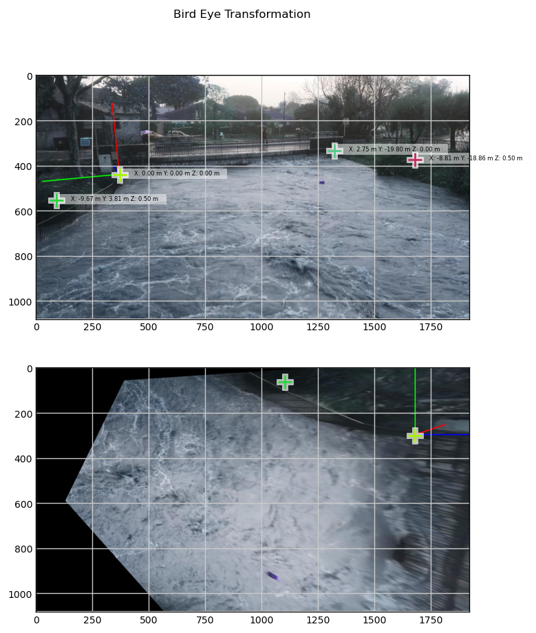
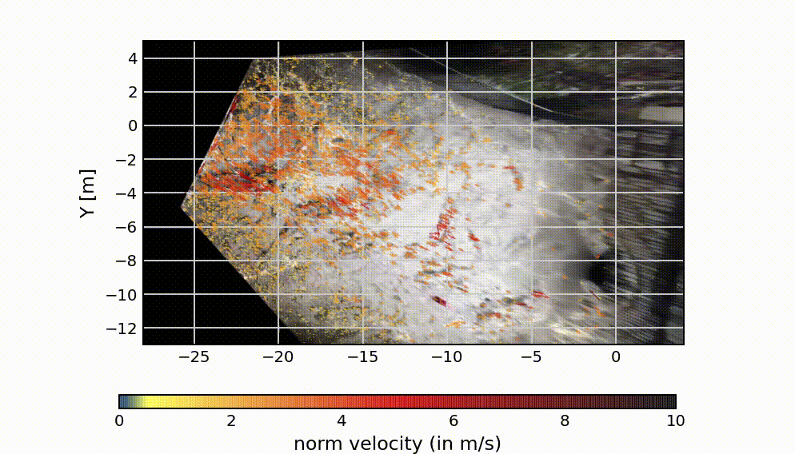
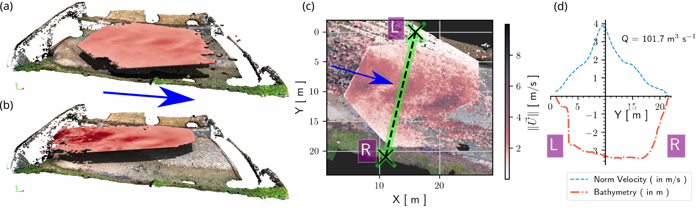

# Stabilization, orthorectification and free surface velocity estimation on the Brague river with opyFlow

## Introduction

This page explains how flow discharge were estimated from raw amateur videos of a flood event the 23rd of November 2019 on the Brague river at Biot (French Riviera). The image analysis consists in the stabilization of images; the bird eye view transformation (also called orthorectification); and an application of the opyf algorithm to obtain free surface velocity and, finally, flow discharges on a given transect.

Follow this [link](https://github.com/groussea/opyflow) to install the opyflow python package.

Then, to apply the algorithm you need to download the video using these links :

- [Video 1139 - upstream view (IMG_1139.MOV)](https://www.dropbox.com/s/npe8srzxls6rav1/IMG_1139.MOV?dl=0)

- [Video 1142 - downstream view (IMG_1142.MOV)](https://www.dropbox.com/s/bq4ed5hsycuqxjk/IMG_1142.MOV?dl=0)

## Initialization

```python
import os, sys
import cv2
import opyf
folder_main='The_folder_where_video_are_downloaded'
# change the working directory
os.chdir(folder_main)
# where are the images?

folder_src = folder_main + '/images/'
# Create a folder to save outputs
folder_outputs = folder_main+'/outputs'
opyf.mkdir2(folder_outputs)
os.chdir(folder_main)

```

## Loading video and set parameters

```python

video=opyf.videoAnalyzer('IMG_1139.MOV')
video.set_vecTime(Ntot=25,starting_frame=200)

video.set_interpolationParams(Sharpness=2)
video.set_goodFeaturesToTrackParams(qualityLevel=0.01)
```

snapshot of video:

[]()

## Loading mask for stabilization

In amateur videos, *hand shaking* produces noise and, by consequence, undesired displacements that can be estimated from *normally immobile zones*.
To determine these *normally immobile zones*, it is required to produce a mask (TRUE/FALSE image) selecting the zones. This localization allows to apply the stabilization algorithm. You can draw your own mask or download a mask that has already been produced for this specific video [here (mask_1139.png)](1139/mask_1139.png). Here the mask select zones were tree/ houses and bridges are.

Mask :

[]()

Python script :

```python
mask=cv2.imread('mask_1139.png')
A=mask>100
video.set_stabilization(mask=A[:,:,0],mute=False)

```

## Orthorectifictation (or bird eye view transformation)

The orthorectification (also called *bird eye view transformation*) is performed by setting the geometrical (XYZ) coordinates of the (Xpx,Ypx) points in the stabilized video.

Here the coordinate in image are

```python
# (Xpx,Ypx) points
image_points = np.array([
                    (355,429), #left 
                    (1338,350), # right
                    (99, 562),     # left front bank
                    (1673, 364),   # riĝht front bank
                ], dtype="double")

# (XYZ) coordinates
model_points = np.array([
                    (30.13,-8.28,0) ,#left 
                    (32.88,-28.08,0),# right bank
                    (20.46, -4.47, 0.4),    # left front bank
                    (21.32, -27.14, 0.4),], dtype="double")  # riĝht front bank

abs_or=model_points[0]
model_points = model_points -model_points[0]

video.set_birdEyeViewProcessing(image_points,
                                model_points, [-12, 4, -32.],
                                rotation=np.array([[1., 0, 0],[0,-1,0],[0,0,-1.]]),
                                scale=True,framesPerSecond=30)
```

This procedure should produce the following:

[]()

## Run *opyFlow*

```python
video.set_vlim([0, 10])

video.extractGoodFeaturesDisplacementsAccumulateAndInterpolate(display1='quiver',display2='field',displayColor=True)
video.set_filtersParams(maxDevInRadius=1.5, RadiusF=0.15,range_Vx=[0.01,10])

video.filterAndInterpolate()
```

[]()

## Additional information

### Citation

This velocimetry analysis have been made for the paper entitled:

*Comparison of streamflow estimated by image analysis (LSPIV) and by hydrologic and hydraulic modelling on the French Riviera during November 2019 flood*.
by  VIGOUREUX et .al  

for the *SimHydro 2021: Models for complex and global water issues - Practices and expectations 16-18 June 2021, Sophia Antipolis*

### Technical informations

Here are some technical explanation specific to the above velocimetry procedure performed with opyfFlow:

Free surface velocities on the Brague river at Biot were also estimated by an open source python package called opyflow. This velocimetry algorithm was developed in [Rousseau (2019)](https://infoscience.epfl.ch/record/264790) to estimate free surface velocities from videos in mountain rivers. As other LSPIV softs (Fudaa-LSPIV), opyflow allows performing  stabilization or orthorectification. Displacements are estimated differently which seems more adapted when image qualities are poor, i.e. when having low signal-to-noise ratio or when velocity information on frames is non-uniform. Inspired by past feature tracking approaches [(Miozzi et al. 2008)](https://doi.org/10.1007/s00348-008-0531-3), the opyflow algorithm estimates the local optical flow of good feature to track [(Shi 1994)](http://www.ai.mit.edu/courses/6.891/handouts/shi94good.pdf), i.e. features having optimal contrasts to be tracked. Using this alternative tracking procedure may improve both efficiency and accuracy on velocity estimations (see [Rousseau (2019)](https://infoscience.epfl.ch/record/264790) – Annex C and F for details and validations). The entire algorithm is available on the gitHub repository : <https://github.com/groussea/opyflow>.

Two videos of the Brague river flood at Biot have been analyzed with the opyflow application in order to obtain stream wise velocities and deduce discharge on a unique transect (both videos observing the same flow area between two bridges in a short time interval). The first video taken from the downstream bridge (1339) has been recorded at 14:15 and the second video (1142) has been recorded from the upstream bridge and has been recorded at 14:27. Observed discharge during this time interval is about 120 m3/s according to field station estimation.  These recordings from two sides allows performing a cross verification of the velocities estimated with opyflow algorithm. Figure – (a,b) shows 3D visualizations of the velocities collected from the two videos and Figure 1 – (c) show the projection of the feature tracking point cloud. The flow rate has been estimated at 102 +/- 20 m3/s (see Figure - (d)). The uncertainties were estimated using the lowest velocity coefficient α = 0.9 ± 0.1 which is in agreement with large submergence flows (Welber et al. 2016) and an uncertainty on the surface position equal to Δh = 0.2 m.

### Cross verification outputs and python processing file

[]()

The above results have been processed using the following [python file]([apply_opyf_1139_1142.py](https://github.com/groussea/opyflow/blob/master/test/Test_Brague_flood/apply_opyf_1139_1142.py)).

To obtain the Flow discharge it is required to use the Digital Terrain Model (DTM) and orthorectified images that are large files. Feel free to ask the authors the DTM to reproduce this result.

