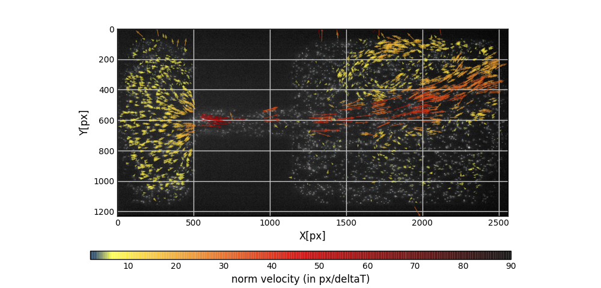

# Test PIV Challenge 2014 - Case A

## Starting

It is important to build a correct work tree for performing the analysis by defining where you will save your outputs and in which folder your process is performed

```python
import os, sys
import opyf
folder_main='.'
# change the working directory
os.chdir(folder_main)
# where are the images?

folder_src = folder_main + '/images/'
# Create a folder to save outputs (csv files, vtk files, hdf5 files, images)
folder_outputs = folder_main+'/outputs'
opyf.mkdir2(folder_outputs)
```

## Build the Analyzer object

Now, you may build an Analyzer object from your frame sequence containing both the information of the sequence and all the parameter for the velocimetry processing and post-processing (optical flow, filters and targeted resolution for the grid to interpolate on).

Because the PIV Challenge have a specific format (*tiff*) it is required to define the *imreadOption=2* (equivalent to the option cv2.IMREAD_ANYDEPTH), to load the correct values for each pixel. Also, the range of pixels must be set (here,*rangeOfPixels=[450, 900]*)

```python
frames = opyf.frameSequenceAnalyzer(folder_src,
                                    imreadOption=2,
                                    rangeOfPixels=[450, 900],
                                    vlim=[2,60])
```

set the displacement limits expected between images (here between 2 and 90 px).

```python
frames.set_vlim([2,90])
```

Another important parameter is the filter *wayBackGoodFlag* which id a filter based on the calculation of the displacement from image A to image B and from B to image A and then evaluate if the way back is located on the initial position. *wayBackGoodFlag=1* specifies that the difference between the initial position and the way back is one.

```python
frames.set_filtersParams(wayBackGoodFlag=1)
```

## Run the analysis

### Good features to track and displacements

```python
frames.extractGoodFeaturesAndDisplacements()
```



- Save your displacements if wanted (in csv or hdf5)

```python
frames.writeGoodFeaturesPositionsAndDisplacements(fileFormat='csv', outFolder=folder_outputs)
```

### Good features to track, displacements and interpolation on a field

```python
frames.extractGoodFeaturesPositionsDisplacementsAndInterpolate()
```


- Save your field if wanted (in csv or hdf5)

```python
frames.writeVelocityField(fileFormat='csv')
```

## Mask

A mask to discard some regions of the frames can be applied

For the PIV Challenge 2014 case A, a mask has been produced previously and is available in the PIV Challenge test folder. The mask can be set when defining the analyzer object or simply using the *set_mask* option.

```python
frames = opyf.frameSequenceAnalyzer(folder_src, imreadOption=2, rangeOfPixels=[450, 900], vlim=[2, 60], mask=folder_main+'/mask.tiff')
```

Or if the frame ocject has already been produced:

```python
frames.set_mask(folder_main + '/mask.tiff')
```

## Performing the velocimetry analysis on the entire dataset

If you loaded the entire dataset, you may run the code bellow
(only the 2 first frames are in the images folder, it is required to download the entire dataset on the [PIV Challenge website - Case A](http://www.pivchallenge.org/pivchallenge4.html#case_a))

It is important to specify the number of frames and the *shift* (here 2 because the frame sequence is constituted of image pairs). The *step* parameter is the number of frame spacing the displacements measure (for pair of images it is very often 1).

```python
frames.set_vecTime(Ntot=600,shift=2,step=1)
```


For technical details on the procedure feel free to check the Annex B of [Turbulent flows over rough permeable beds](https://infoscience.epfl.ch/record/264790/files/EPFL_TH9327.pdf).
